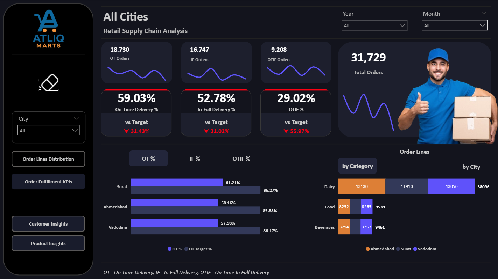
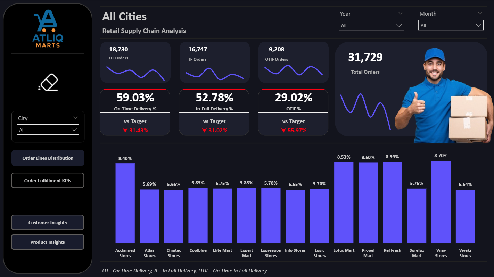
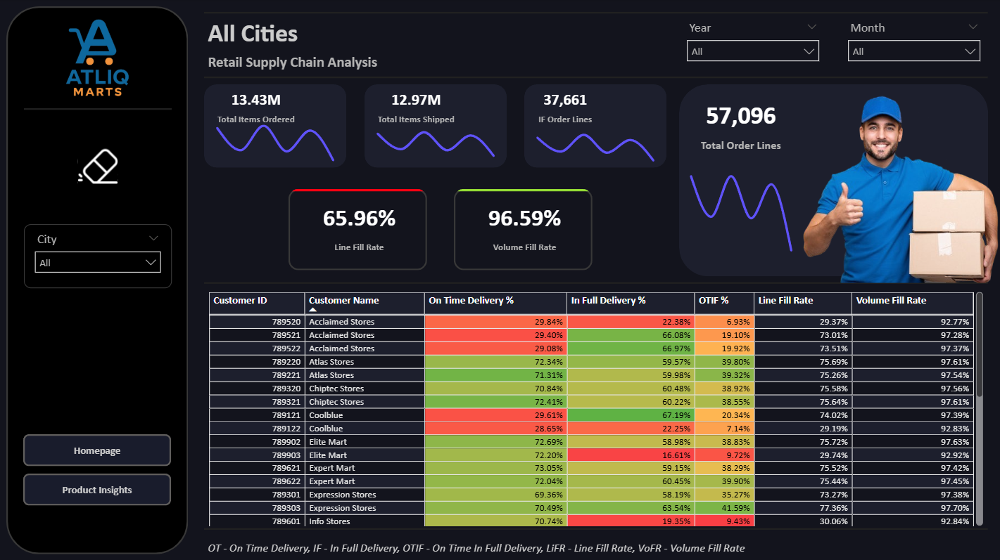
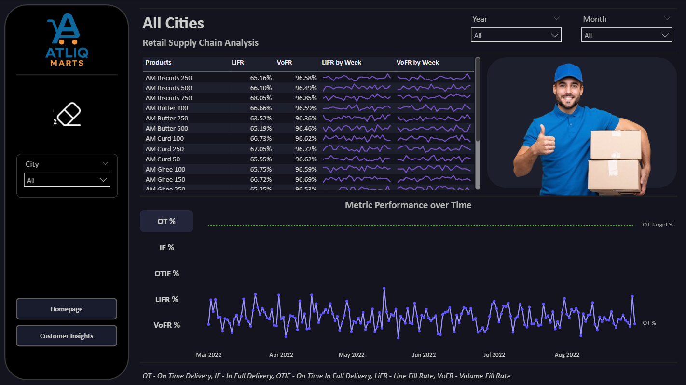
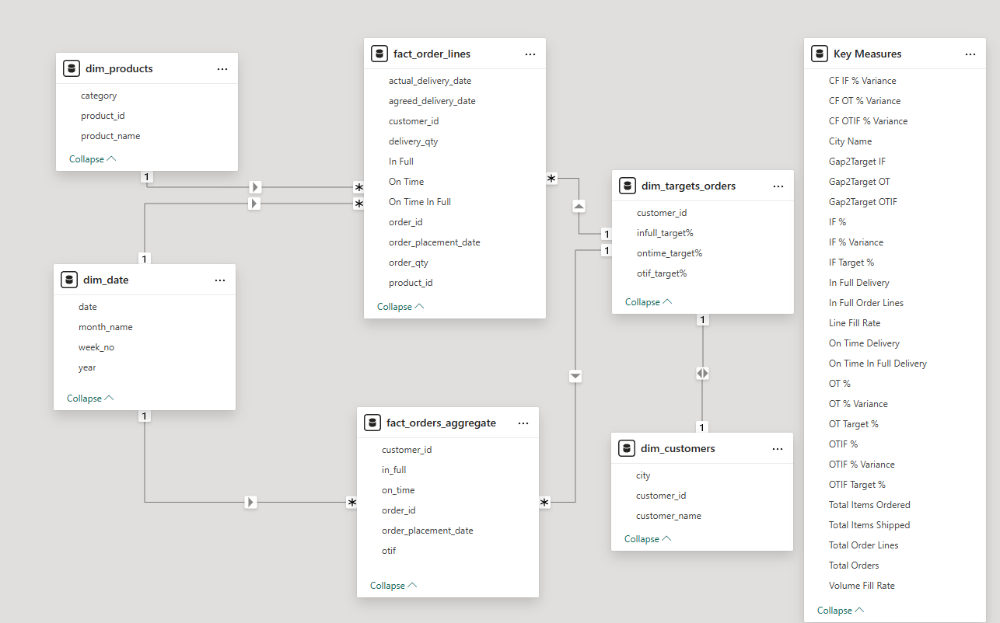

# 📦 AtliQMart Supply Chain Analysis

This repository presents a **Power BI project** analyzing the supply chain performance of **AtliQMart**, an FMCG company.  
The project was developed as part of the [Codebasics Resume Project Challenge #5](https://codebasics.io/challenges/codebasics-resume-project-challenge/5), which simulates a real‑world business problem where AtliQMart’s management seeks actionable insights into their supply chain operations.

---

## 🎯 Project Objective

The objective of this project is to help **AtliQMart management**:

- Gain visibility into supply chain operations across customers, products, and regions  
- Identify bottlenecks, inefficiencies, and opportunities for optimization  
- Provide **executive-level KPIs** for top management decision-making  
- Enable **interactive exploration** of customer and product performance  
- Build a scalable **data model** for future supply chain analytics initiatives  

---

## 🛠️ Tech Stack

- **Power BI** – Dashboard creation, DAX measures, interactive visuals    
- **Excel / CSV** – Supplementary datasets  
- **Data Modeling** – Star schema, relationships, calculated columns, measures  
- **Git & GitHub** – Version control and collaboration  
- **Git LFS** – Managing large `.pbix` files efficiently  

---

## 📂 Repository Contents

- **Power BI Dashboard File (`.pbix`)**  
- **Screenshots of Dashboard Pages**  
- **Data Model Documentation**  
- **Project Notes & Methodology**  

---

## 📊 Dashboard Views & Screenshots

### 👔 Executive View
One-page summary of all critical KPIs for top management.  

### 👥 Customer Analysis
KPIs: Customer segmentation, revenue contribution, order patterns, and retention metrics.  

### 📦 Product Analysis
KPIs: Product demand, top-performing SKUs, supply chain efficiency, and distribution trends.  

### 🗂️ Data Model
Comprehensive snoflake schema integrating fact and dimension tables from MySQL, Excel, and CSV sources.  

---

## 🔗 Live Dashboard

Explore the interactive dashboard here:  
👉 [Live Power BI Dashboard](https://app.powerbi.com/view?r=eyJrIjoiOTE2MzI3MmEtYzRmMC00NzJlLWIyMjQtMWRjMWI4NzQyMmE0IiwidCI6ImM2ZTU0OWIzLTVmNDUtNDAzMi1hYWU5LWQ0MjQ0ZGM1YjJjNCJ9)

---

## 📘 Learnings

- Building a **comprehensive data model** integrating multiple sources  
- Designing **executive-friendly dashboards** with clear KPIs  
- Applying **DAX measures** for advanced calculations  
- Creating **cross-page navigation** for user-friendly experience  
- Understanding **supply chain analytics** such as :
  - **IF (In-Full Delivery)** – tracks completeness of orders
  - **OT (On-Time Delivery)** – tracks timely fulfillment of orders
  - **OTIF (On-Time In-Full)** – evaluates both timeliness and completeness of deliveries
  - **LiFR (Line Fill Rate)** – measures the percentage of order lines fulfilled without shortages
  - **VoFR (Volume Fill Rate)** – measures the proportion of total order volume fulfilled  
- Leveraging the **new Power BI card with reference layouts** to compare KPIs side by side for insightful analysis
- Incorporating **Power BI bookmarks** to create multiple views within the same report, enabling users to toggle between perspectives (e.g. Top Customers by Order Lines & Order Fulfillment KPIs) seamlessly  
- Applying **Power BI dashboard design principles** such as consistent color palettes, intuitive layouts, minimal clutter, and clear storytelling to make dashboards more engaging and decision‑friendly  

---

## 🏆 Project Outcome

The **AtliQMart Supply Chain Data Analytics dashboard** revealed clear performance challenges across the network:

- **Overall Service Level Issues:** OTIF (On‑Time In‑Full) delivery consistently falls short of the 95% target benchmark. Both Line Fill Rate (LIFR) and Volume Fill Rate (VOFR) show significant variability, highlighting uneven supply chain execution.  
- **City‑wise Disparities:** Underperforming regions in terms of LIFR below 90%, point to regional bottlenecks in warehousing, distribution, or vendor reliability.  
- **Product Category Gaps:** While Line Fill Rate (LiFR) is consistently weak across categories (≈65% for Beverages, Dairy, and Food vs. 95% benchmark), indicating systemic fulfillment issues, the Volume Fill Rate (VoFR) remains strong (≈96% across categories), showing bulk quantities are met but line‑level precision is lacking.  
- **Weekly Trends:** LiFR shows unstable fluctuations with no sustained improvement, while VoFR remains consistently strong, highlighting resilient overall capacity but weak line‑level execution.
- **Gap to Target Analysis:** While many KPIs achieve Green performance (≥95%), several regions and categories still fall into Amber (90–94%) or Red (<90%), highlighting the need for standardized processes and more robust forecasting.

### 🎯 Recommended Solutions
- **Improve Forecasting:** Implement demand planning models to anticipate seasonal spikes and reduce VOFR dips.  
- **Regional Optimization:** Prioritize corrective actions in underperforming cities with targeted inventory buffers.  
- **Category Management:** Strengthen supplier contracts and safety stock for volatile categories.  
- **Process Standardization:** Scale best practices from high‑performing cities across the network.  
- **Continuous Monitoring:** Leverage dashboard conditional formatting (Green/Amber/Red) to track KPIs weekly and trigger alerts.

---

✅ In summary, the dashboard provides **actionable visibility into where and why OTIF is failing** — by city, category, and month. These insights enable AtliQMart to **tighten forecasting, balance inventory regionally, and replicate best practices from strong performers** to achieve consistent service levels across the supply chain. 

---

## 👨‍💻 Author

Developed by **Prashant**  
Passionate about **data analytics, visualization, and business intelligence**.  
